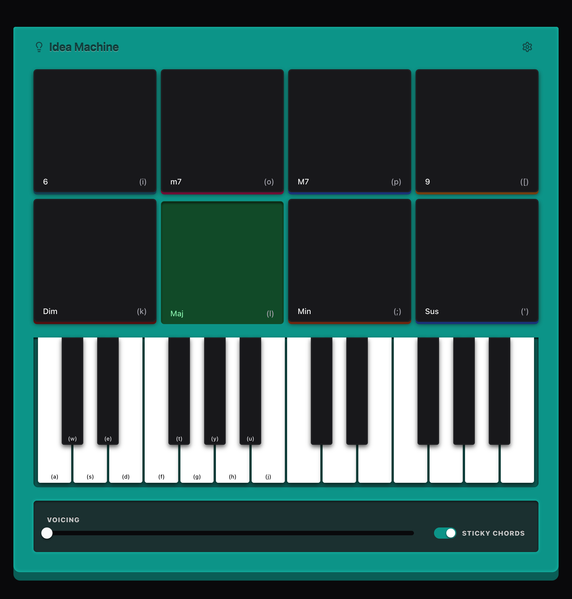

# Idea Machine

A MIDI chord generator inspired by [Orchid](https://telepathicinstruments.com/).

Use your MIDI Controller or your keyboard to generate chord variations and route to your DAW for recording.

## Built With

* [WEBMIDI](https://webmidijs.org/) - for MIDI input/output and manipulation
* [Tone.js](https://tonejs.github.io/) - for the default synth sound
* [React](https://react.dev/)
* [Chakra UI](https://chakra-ui.com/)
* [Zustand](https://github.com/pmndrs/zustand)
